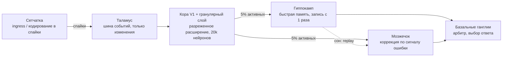

# SynapseBrain

Мозг из «микросервисов», работающий на синапсах. Часть 2 — языковая модель, которая
соревнуется с трансформером на его родной задаче; часть 1 (ниже) — первый эксперимент со зрением.

# Часть 2. SynapseBrain-LM против трансформера

**Задача:** предсказывать следующий символ на стандартном бенчмарке **enwik8** (100 МБ Википедии):
обучение — первые 90 МБ, тест — последние 5 МБ. Метрика — **биты на символ (bpc)**, меньше —
лучше. Всё на одной машине: 4 ядра Xeon (с AMX), без GPU.

## Итог по всем измеренным аспектам

| Аспект | Трансформер | SynapseBrain | Кто лучше |
|---|---|---|---|
| Качество при равном времени обучения (10 мин) | 1.877 bpc (4 ядра + AMX) | **1.383 / 1.453 / 1.602** (1 ядро) | мозг, во всех 3 режимах |
| Качество против трансформера с **4.4× временем** (44 мин) | 1.489 | **1.383** учится / **1.453** веса заморожены / 1.602 строго заморожен | мозг в 2 режимах из 3 |
| Рост качества с данными (1…90 МБ) | 2.35 → 1.82 | **1.63 → 1.43** | мозг на каждом объёме |
| Цена токена при длинном контексте | 1.4 мс (1k) → 11 мс (64k) | **6.3 мкс при 4M и 32M** | мозг, ~200–1700× |
| Память под контекст | KV-кэш растёт (268 МБ при 64k) | фиксированная + 1 байт/символ | мозг |
| Вспомнить факт 3 МБ назад («иголка») | 8–9 бит/символ (не помнит) | **0.07–0.28 бит/символ** | мозг |
| Забывание после дообучения на коде | Википедия **+60…72%** хуже | **+9.9%** | мозг |
| Выучить новый домен (код, 10 МБ) | 1.58–1.68 bpc за 54–120 с | **1.10 bpc за 54 с** | мозг |
| Генерация: настоящие слова / пары / тройки слов (T=0.7) | 94.8 / 66.4 / 30.9 % | **95.7 / 69.7 / 30.9** % | мозг / мозг / ничья |
| Генерация: удержание темы / зацикливание (T=0.7) | 8.9 % / 4.6 % | **12.8 %** / **3.9 %** (с «интересом») | мозг / мозг |
| Скорость генерации | 228 байт/с (~770 с KV-кэшем) | **~70 000 байт/с** | мозг, ~100× |
| Обучение с подкреплением (MiniCraft, конец) | DQN: 27.4 | **60.5** | мозг, 2.2× |
| RL: скорость старта (эпизоды 12–21) | 27.0 | 26.5 | ничья |
| RL: цена шага | 551 мкс | **148 мкс** | мозг, 3.7× |
| **Память (RAM)** | **7–13 МБ весов** | 6.7 ГБ | **трансформер** |

Где трансформер ещё впереди: **строго замороженный режим** против трансформера, учившегося в 4.4 раза
дольше (1.602 против 1.489), и **объём памяти**. Удержание темы и ранняя скорость в RL — ничья в
пределах шума. Всё остальное измеренное — за мозгом.
Обновление: после добавления «интереса к разговору» удержание темы — тоже за мозгом (см. «Эмоции»).

## Архитектура: отделы мозга вместо внимания

Каждый байт предсказывается по битам — 8 бинарных решений. Всё учится онлайн: предсказал →
увидел правду → поменял только те синапсы, которые участвовали. Backprop нет.

| Отдел | Что делает | Чем заменяет часть трансформера |
|---|---|---|
| **Гранулярный слой** (18 популяций) | Каждая популяция смотрит на прошлое по-своему (1–8 байт, слово, пара/тройка слов, пропуски, тема, позиция в предложении) и активирует **одну клетку** из миллионов, лежащую в 64-байтной «колонке» | Эмбеддинги + FFN (что за чем следует) |
| **Клетки места** | «Где мы» в документе: внутри `[[ссылки]]`, `{{шаблона}}`, `<тега>`, колонка; слово + место; ритм классов символов; символ над текущим | Позиционное кодирование + структура |
| **Кратковременная пластичность** | Каждая клетка помнит свои последние 6 исходов | Быстрая адаптация «в контексте» |
| **Гиппокамп** (2 глобальных индекса) | Хеш последних 6 и 16 байт → прошлый такой же момент во всём прочитанном; O(1), расстояние не ограничено | Индукционные головы на «бесконечном» контексте |
| **Рабочая эпизодическая память** | Индекс по 3 байтам, только последние 2 КБ | Индукционная голова в окне |
| **Семантическая память** (новое) | Хеббовские ассоциации слов («что встречается вместе — связывается», 8 синапсов на слово) + кольцо из 64 недавних слов; в начале слова предактивирует слова темы (прайминг) | Внимание к теме / смыслу |
| **Мозжечок** (5 карт микрозон) | Смешивает голоса; веса выбираются контекстом и учатся по сигналу ошибки, «критический период» темпа | Слои смешивания + обучение |
| **Базальные ганглии**, **таламус** | Обучаемые арбитры и калибровочные карты уверенности | Выходной слой, калибровка |
| **Рабочая память клеток** | При замороженных весах новые контексты получают клетки в отдельной области | KV-кэш |

Три режима на тесте: *строго заморожен* (меняется только хранилище прочитанного текста),
*веса заморожены + рабочая память* (аналог окна контекста / KV-кэша), *продолжает учиться*
(аналог «динамической оценки» трансформера, которая стоила бы ему backprop на каждом шаге).

## Честность сравнения

- Трансформер — байтовый GPT (pre-LN, GELU, связанные эмбеддинги, AdamW, прогрев + косинус,
  bf16 через AMX, все 4 ядра; bf16 ускорил его в 2.5 раза). Мозг работает на **одном** ядре.
- Ошибка инициализации трансформера найдена и исправлена (2.83 → 2.15 bpc при 140 с).
- После исправления перебрано 5 конфигураций для равного бюджета; для длинного — 4 слоя × 256.
- Трансформер оценивается скользящим окном; каждый символ видит ≥ половины окна.
- Для масштабирования по данным — dropout, валидация каждые 30 с и лучшая точка (ранняя остановка).
- DQN в RL подобран из 4 вариантов (лучший: lr 1e-3, обучение раз в 4 шага).
- Генерация оценивается на 60 затравках: на 20 затравках шум давал ложное преимущество мозгу.
- Гиперпараметры мозга подбирались на обучающей части, тест не трогался.

## Как модель улучшалась (enwik8, тест 5 МБ)

| Версия | Учится | Веса замор. + РП | Строго замор. | Обучение |
|---|---|---|---|---|
| v1: 8 популяций, 1 гиппокамп, 3 микрозоны | 1.600 | — | 1.779 | 139 с |
| + кратк. пластичность, микрозоны новизны | 1.485 | 1.564 | 1.839 | 266 с |
| + распределение памяти, 2-байтные микрозоны, тройки слов | 1.444 | 1.522 | 1.815 | 287 с |
| + клетки места, ритм символов, вертикальный контекст | 1.413 | 1.491 | 1.750 | 339 с |
| + 2-й гиппокамп, финальный арбитр | 1.408 | 1.485 | 1.739 | 366 с |
| + тема, позиция в предложении, прайминг, рабочая эпизодическая память, **семантическая память** | **1.383** | **1.453** | **1.602** | 603 с |

## Генерация текста

60 затравок по 300 байт из тестового текста, по 400 сгенерированных байт (`coh_eval.py`):
*слова* — доля настоящих слов; *пары/тройки* — доля пар/троек слов, встречающихся в языке
(синтаксис); *тема* — доля содержательных слов затравки, вернувшихся в продолжении;
*повторы* — доля повторяющихся 4-грамм (зацикливание).

| | Слова | Пары | Тройки | Тема | Повторы |
|---|---|---|---|---|---|
| Реальный текст (потолок) | 95.9 | 68.8 | 32.1 | 16.7 | 3.0 |
| Трансформер ×4.4, T=0.7 | 94.8 | 66.4 | **30.9** | **8.9** | 4.6 |
| **Мозг, T=0.7** | **96.1** | **71.4** | 30.5 | 8.6 | **2.5** |
| Трансформер ×4.4, T=0.6 | 95.6 | 73.5 | 38.8 | 9.9 | 9.6 (зацикливается) |
| Мозг, T=0.6 | 96.2 | 71.0 | 32.8 | 7.7 | 7.9 |

Удержание темы долго было главным отставанием мозга (3.5% против 11%). Его закрыли две вещи из
нейробиологии: прайминг недавних слов и хеббовская семантическая память ассоциаций. Примеры
текстов — в [`samples.md`](samples.md).

## Рост качества с данными (тест: отложенный 1 МБ)

| Данные | Мозг: время | Мозг: учится | Мозг: РП | Трансформер: время | эпох | Трансформер |
|---|---|---|---|---|---|---|
| 1 МБ | 9 с | **1.631** | **1.818** | 480 с | 19.3 | 2.347 |
| 3 МБ | 20 с | **1.565** | **1.679** | 600 с | 8.1 | 2.097 |
| 10 МБ | 62 с | **1.509** | **1.601** | 720 с | 2.8 | 2.002 |
| 30 МБ | 181 с | **1.467** | **1.545** | 900 с | 1.2 | 1.930 |
| 90 МБ | 552 с | **1.429** | **1.486** | 1200 с | 0.5 | 1.823 |

Кривая трансформера круче, но на больших объёмах он ограничен временем, а не данными; сойдутся ли
кривые при гораздо больших вычислениях — этот эксперимент не показывает.

## Действия в реальном времени: MiniCraft → Minecraft

`agent/` — тот же мозг, но для действий: сенсорная кора (гранулярные популяции по наблюдению) →
стриатум (синапс на действие у каждой активной клетки) → **дофамин** = ошибка предсказания награды
(TD), доставляемая по затухающим следам активности (трёхфакторное правило) → мозжечковая модель
мира (опционально — любопытство). Только локальные обновления активных синапсов.

MiniCraft (`agent/minicraft.py`): мир 16×16, деревья, камень, лава, вода; обзор 5×5 перед собой;
действия: вперёд, повороты, добыть, ждать; +1 за дерево, +0.3 за камень, −1 за лаву. 60 000 шагов,
3 сида, одинаковое ε-исследование:

| Эпизод | 21 | 51 | 101 | 200 | мкс/шаг |
|---|---|---|---|---|---|
| Случайный агент | 0.5 | 0.3 | 0.9 | 0.8 | 17 |
| **Мозг** | 26.5 | **39.3** | **53.0** | **60.5** | **148** |
| DQN (лучший из 4) | 27.0 | 28.5 | 21.3 | 27.4 | 551 |

`minecraft/` — мост к настоящей игре: `bot.js` (Mineflayer) видит сетку 5×5 блоков перед собой,
считает награду (+1 полено, +0.3 камень, −1 урон/смерть) и выполняет действия; `brain_server.py`
держит мозг, учит его на каждом шаге и сохраняет синапсы на диск. Сквозной тест по TCP (без
игры, мир MiniCraft через тот же протокол): агент учится с 1.6 до ~45 очков за эпизод,
3 500 шагов/с — в сотни раз быстрее, чем нужно игре (4–20 решений/с).

```bash
cd minecraft && npm install
python3 brain_server.py                     # мозг, порт 5555
node bot.js --host <сервер> --port 25565    # тело в игре (офлайн-режим сервера)
```

## Эмоции (лимбическая система)

Эмоции добавлены не как «чувства», а так, как они работают в мозге: как **нейромодуляторы**,
меняющие режим других отделов. Каждая проверена отдельно, включено только то, что помогло.

**«Интерес к разговору» (язык):** слова затравки получают эмоциональную метку «важно» и попадают
в память цели (префронтальная кора), которую не вытесняет сгенерированный текст; во время речи
они и их ассоциации остаются предактивированными с силой «интереса». 60 затравок, T=0.7:

| | Слова | Пары | Тройки | Тема | Повторы |
|---|---|---|---|---|---|
| Трансформер ×4.4 | 94.8 | 66.4 | 30.9 | 8.9 | 4.6 |
| Мозг без интереса | 96.1 | 71.4 | 30.5 | 8.6 | 2.5 |
| **Мозг, интерес 8 (по умолчанию)** | **95.7** | **69.7** | **30.9** | **12.8** | **3.9** |
| Мозг, интерес 16 | 95.7 | 68.4 | 27.1 | 15.1 | 0.5 |
| Реальный текст | 95.9 | 68.8 | 32.1 | 16.7 | 3.0 |

С интересом 8 мозг не хуже трансформера ни по одной метрике связности и заметно лучше держит тему.
При слишком сильном интересе тема почти как у живого текста, но страдает синтаксис —
«одержимость темой».

**Агент (MiniCraft, 60 000 шагов, 3 сида):**
- **Страх (миндалина)** — быстрая, с одного раза, память о вреде, привязанная к *конкретному стимулу*
  (что прямо впереди), медленно угасающая. Попаданий в лаву в **3–8 раз меньше** (обычный мир:
  0.33 → 0.04 за эпизод; суровый: 0.21 → 0.07), очки — на прежнем уровне. Первая версия боялась
  всей ситуации целиком и просто перестала двигаться — это была модель *тревожности*; исправлено.
  Включён по умолчанию для Minecraft, где смерть стоит всего инвентаря.
- **Настроение/скука (серотонин, норадреналин)** — при ухудшении относительно привычного или долгом
  отсутствии успеха агент больше исследует и становится любопытным. **Не помогло**: в обычном мире
  53.4 против 60.5, в суровом — ничья. Оставлено выключенным (`mood=True` включает).

## Первый запуск в настоящем Minecraft

Сервер Minecraft Java 1.20.4 (офлайн, мирный режим, без защиты спавна) поднят в том же контейнере,
бот — Mineflayer, мозг — `minecraft/brain_server.py`, учится на каждом шаге (~3–4 решения/с,
ограничено игрой, не мозгом).

| Попытка | Результат |
|---|---|
| С нуля, обзор 5×5 | 1 полено за ~3 000 шагов (15 мин): награда слишком редкая |
| + «детство» в MiniCraft (100 тыс. шагов, 15 с) | 0 поленьев: бот ушёл из леса — деревья дальше его обзора |
| + дальнее зрение (направление на ближайший ствол), листва ≠ дерево | 4 полена за первые 200 шагов, потом застрял у ствола, висящего выше головы |
| + дальнее зрение только на досягаемые брёвна | ещё 4 полена за ~800 шагов, затем досягаемые брёвна в радиусе 32 блоков закончились |

Что понадобилось для реального мира — и всё это тоже «из мозга»: детство в безопасной
песочнице с переносом навыков (`minecraft/pretrain.py`), дальнее зрение, «аппетит» (немного
дофамина за приближение к видимому дереву), страх, автопрыжок на уступы. Чего не хватает: бот не
умеет ставить блоки и забираться к верхним брёвнам, не крафтит и не ищет новые леса — это
следующие навыки. Стабильной кривой обучения за такое короткое время ещё нет — нужен долгий прогон.

## Знания Minecraft и зрение

**Энциклопедия.** С Hugging Face: полная Minecraft Wiki (45 042 раздела статей, 2023, `KoalaBrainResearcher/Minecraft-Wiki-2023`),
87 934 вопроса-ответа по вики (`lparkourer10/minecraft-wiki`), инструкции и действия игроков из
CraftJarvis. Мозг, прочитавший Википедию, дочитал 80.6 МБ Minecraft за один проход (`mc_learn.py`):

| | До | После |
|---|---|---|
| Отложенные статьи Minecraft Wiki, bpc | 1.199 | **0.800** (−33%) |
| Английская Википедия, bpc (забывание) | 1.486 | 1.745 (+17%) |

Честно: ответы на вопросы («как сделать верстак?») получаются про Minecraft и связные по форме, но
фактически неверные — модель предсказывает текст, а не ищет ответ; для этого нужен механизм
извлечения нужной статьи. Первая версия корпуса была плохой (служебная инструкция CraftJarvis
×600 в конце — модель её «зазубрила»); после чистки и перемешивания забывание упало с +32% до +17%.

**Зрение** (`vision/`). Настоящий 3D-вид от первого лица (prismarine-viewer с текстурами Minecraft)
снимается безголовым Chromium (`minecraft/eyes.py`) → сетчатка (10 карт спайков: края ON/OFF,
6 цветов, тёмное/яркое) → зрительная кора (8 192 нейрона, локальные рецептивные поля, 3% активны).
Кора развивается без разметки: структурная хеббовская пластичность + гомеостаз (без гомеостаза
развитие *ухудшало* зрение — нейроны уходили на вечно активные входы вроде неба).

- **Развитие** на 124 375 кадрах MineRL Navigate (995 роликов людей в лесах, горах, деревнях).
- **Зеркальные нейроны** (угадать действие человека по одному скриншоту CraftJarvis): около уровня
  «самого частого ответа» — по одному кадру намерение не видно; задача признана неудачной.
- **Кросс-модальное обучение** в живой игре: прямые чувства бота учат глаза. 4 000 живых кадров
  (телепорт по разным биомам), тест на невиденных записях, только картинка:

| Что угадывает зрение | Случайно / самый частый | Кора после развития |
|---|---|---|
| Можно ли шагнуть вперёд (сбалансированно) | 50% | **75–79%** |
| Есть ли дерево в зоне 5×5 | 59.5% | **66.8%** |
| Направление на ближайшее бревно (5 классов) | 20% / 8.6% | **34.3%** |

Зрение подключено к агенту: активные нейроны коры — входы стриатума вместе с прямыми чувствами
(`brain_server.py --eyes ... --see`), кора продолжает развиваться в игре; есть режим «только
зрение» (`--blind`). Зрение пока слабое — 4 000 кадров для зрения очень мало.

## Самостоятельная жизнь: «Синапс»

Вместо награды, которую назначает человек (+1 за бревно), у бота теперь внутренняя мотивация
(`minecraft/personality.py`), как у животного:
- **новизна** — радость, когда впервые держишь предмет нового типа; к знакомому быстро привыкание;
- **исследование** — новое место (чанк) приятно, изученное — нет;
- **потребности** — голод и боль (гипоталамус, миндалина);
- **молодость и скука** — исследует больше, пока молод и когда давно не было ничего приятного;
- **мастерство** — действие «смастерить что-то новое» (сам ставит верстак), «поесть»;
- **автобиография** — имя, возраст, что знает, где был, смерти (`self.json`) и дневник, который
  пишет сам бот; о своих открытиях он говорит в чате игры. Память переживает перезапуски.

Первые 20 минут жизни (2 500 шагов, зрение включено, без телепортов и без моих наград) —
13 открытий, которые никто не задавал: дубовые доски, кнопка, нажимная плита, **деревянная лопата**,
земля, **еловые брёвна** (добыл 23), еловые доски и древесина, **палки**, **песок** и **песчаник**;
9 исследованных областей. Потом утонул — и записал это в дневник. Дневник:
[`results_self_diary.md`](results_self_diary.md).

Честно: это автономный агент с внутренней мотивацией и памятью, а не «личность» в человеческом
смысле. Его «речь» — шаблонные фразы, связанные с событиями, а не свободный разговор; языковой мозг
к речи бота ещё не подключён. Он мастерит «бесполезные» кнопки просто потому, что новое —
интересно; дорога к кирке и камню ему ещё предстоит.

## Полное управление, знания и голос

Тело (`minecraft/bot.js`) даёт мозгу **26 действий** — движение во все стороны, прыжок, бег, Shift,
взгляд вверх/вниз, удар (драка), использование предмета, копание, надевание брони, выбор оружия и
инструмента, установка блоков, крафт нового и лучшего снаряжения, переплавка в печи, еда, сон в
кровати, выброс мусора. Самопроверка в живой игре: **14/14 проверок пройдены** (броня надета, меч в
руке, Shift и бег, кирка скрафчена, печь поставлена и загружена, свинья ударена, кровать поставлена и
бот уснул…). Когда что делать — выбирает сам мозг.

Справочник (`minecraft/knowledge/`): все **729 рецептов** и **110 достижений** версии 1.20.4;
достижения — источник радости и записей в дневнике. Голос: языковой мозг прочитал Minecraft Wiki и
справочник; вопросы сначала ищутся в эпизодической памяти по смыслу (как гиппокамп достаёт
воспоминание по подсказке) — в игре Синапс правильно ответил, как сделать верстак («4 Oak Planks»),
железную кирку («3 Iron Ingot, 2 Stick»), как получить «Stone Age» и кто он сам. Свободные вопросы
(«что делают криперы?») он пока отвечает плохо.

Запуск на своём компьютере: [`minecraft/README.md`](minecraft/README.md).

## Разум: логические цепочки, навыки, рассуждение — в синапсах

Чеклист перед запуском на своём ПК и что сделано (`agent/mind.py`). Ни одного правила о мире в
коде нет: только популяции нейронов и пластичность. Всё, что Синапс узнаёт, хранится в весах
(`life/mind.npz`), а не в файлах с программами навыков.

| Требование | Как устроено в мозге |
|---|---|
| Видит окружение + подкрепление сенсорами | Зрительная кора (картинка от первого лица) → считывающие нейроны учатся **прямо в игре**, учитель — прямые чувства (блоки 5×5, небо, дерево); `vision/teacher.py`. Новые сенсоры: осязание со всех 4 сторон, над головой и под ногами, «вижу небо», «застрял». `--blind` — действовать только по зрению |
| Запоминает логические цепочки и сам их строит | **Нейроны понятий** растут при первой встрече («у меня есть доски», «вижу небо», «свободен»). **Синапсы цепочек** C[p→e]: насколько надёжно понятие p было активно перед тем, как случилось событие e. Сильные связи = выученные предпосылки |
| Навыки запоминает сам | **Синапсы навыков** в базальных ганглиях G[признаки×цель → действие]: как сделать, чтобы случилось событие. Учатся **воспроизведением в гиппокампе**: после каждого события последние моменты проигрываются назад («вот как я выбрался из ямы»), плюс непрерывный replay старых моментов для всех целей. Все навыки — в одном массиве синапсов |
| Умеет рассуждать | **Префронтальное распространение активации**: желание течёт назад по синапсам цепочек от цели к недостающему, пока не дойдёт до того, что можно сделать сейчас. Та же активность, прочитанная вслух, — объяснение: «Хочу железную кирку. Чтобы иметь кирку, нужно иметь слитки…» |
| Тяга к новому и к самопознанию | Ценность событий (дофамин) выучивается; **нейроны компетентности** — как часто у меня получается каждая цель; любопытство к себе — цели, которые я редко пробовал, интересны. На «что ты умеешь?» отвечает из этих нейронов |
| Самостоятельная личность | Прежние мотивация, автобиография, дневник, страх, голос — плюс мысли вслух: новая цель → запись «думаю: …» в дневник и фраза в чате |

**Проверка: CraftWorld** (`agent/craftworld.py`, `agent/chain_bench.py`). Мир, похожий на Minecraft:
деревья растут **только на поверхности**, агент часто рождается **в глубине пещеры** (видит свет в
конце туннеля) или **в яме** (идти бесполезно — нужно копать стены и строить под собой); дерево
технологий на 9 шагов с количествами: бревно → доски → палки, верстак → деревянная кирка →
булыжник → каменная кирка → железная руда → печь → слиток → **железная кирка**. Каждая жизнь — новый
мир, инвентарь теряется, память остаётся. Награда одинаковая для обоих мозгов: +1 за первый в жизни
предмет каждого типа. 160 жизней × 800 шагов, 3 сида:

| Жизни | Мозг | Уровень технологий (из 9) | Железная кирка | Выход из пещеры к небу (медиана) | Выход из ямы |
|---|---|---|---|---|---|
| 1–40 | привычки (прежний мозг) | 3.80 | 1.7% | 67 шагов | 40 шагов |
| 1–40 | **разум** | 5.54 | 10.0% | 91 | 13 |
| 81–120 | привычки | 3.57 | 0% | 25 | 10 |
| 81–120 | **разум** | **8.22** | **62.5%** | 52 | 4 |
| 121–160 | привычки | 3.57 | 0% | 54 | 9 |
| 121–160 | **разум** | **7.94** | **55.8%** | 61 | **2** |

Прежний мозг (одна система привычек, TD(λ), страх) навсегда застревает на верстаке/деревянной кирке:
награда за первый предмет каждого типа не складывается у него в цепочку из 9 шагов. Разум с той же
наградой в среднем доходит до печи и железа и больше чем в половине жизней делает железную кирку.
Сырые выводы: `results_chains.txt`.

Цепочки, прочитанные прямо из синапсов после обучения (никто их не задавал):

```
have:iron_pick ← have:planks + have:stick + have:table + have:wood_pick + have:cobble + have:stone_pick + have:furnace + have:iron_ingot + free
free ← have:dirt + in_pit
have:dirt ← in_pit
have:iron_ingot ← have:planks + have:stick + have:table + have:wood_pick + have:stone_pick + have:furnace + have:iron_ore + free
have:iron_ore ← have:planks + have:stick + have:table + have:wood_pick + have:cobble + have:stone_pick + free
have:stone_pick ← have:planks + have:stick + have:table + have:wood_pick + have:cobble + free
have:cobble ← have:planks + have:stick + have:table + have:wood_pick + free
have:wood_pick ← have:planks + have:stick + have:table + sky + free
have:table ← have:planks + sky + free
have:planks ← have:log + sky + free
have:log ← sky + free
have:stick ← have:planks + have:table + sky + free
have:furnace ← have:planks + have:stick + have:table + have:wood_pick + have:cobble + have:stone_pick + have:iron_ore + free
```

Он сам вывел: «брёвна добываются только под небом» (значит, из пещеры надо выйти), «чтобы
выбраться из ямы, нужна земля, а земля добывается, когда я в яме» (копать стены → строить под
собой), «булыжник — только с деревянной киркой». Лишние предпосылки (доски «нужны» для булыжника)
— честная статистика опыта: доски у него всегда были в тот момент.

**В настоящем Minecraft** (`brain_server.py --mind`, по умолчанию в `run_synapse.py`): тело
получило 28 действий, включая **подъём с блоком под собой** (`pillar_up`) и **копание вверх**;
самопроверка **16/16**. В живой игре разум заводит понятия из инвентаря и сенсоров, говорит мысли
вслух и отвечает из синапсов:

```
<Tester> Синапс, что ты умеешь?
<Synapse2> Я Синапс. Лучше всего у меня получается: свободно двигаться (94%), застрять (83%),
           иметь землю (50%). Я заметил 9 вещей о мире и о себе.
<Tester> Синапс, как получить землю?
<Synapse2> Про «иметь землю» я пока не понял, что для этого нужно — видел это слишком мало раз.
```

Честно: в CraftWorld цепочки и навыки складываются за ~50 жизней; в Minecraft событий гораздо
больше и они реже, поэтому там это займёт часы и дни игры — ответы выше сняты в первые минуты его
жизни. «Рассуждение» — это обратный поиск по выученным причинно-следственным связям, а не
рассуждение словами. Из пещеры разум выбирается не быстрее «привычного» мозга (52–61 шаг против
25–54), хотя тот так и не научился ничему дальше деревянной кирки. Зрение по-прежнему
слабое: учитель-сенсоры подтягивают его в игре, но главным источником пока остаются прямые чувства.

## Чувства: лимбическая система и развитие как у ребёнка

`agent/limbic.py`, `agent/child.py`, мир `agent/lifeworld.py`, опыты `agent/life_bench.py`.

**Что врождённое («геном» — только то, что есть у младенца):** голод, боль, усталость, тошнота;
вкус еды (удовольствие сильнее, когда голоден); испуг от громкого звука; реакция на интонацию
(тёплый голос успокаивает, ругань неприятна, тревожный — возбуждает); мурлыканье приятно;
тяга ко всему, что движется само; любопытство — удовольствие от того, что **начинаешь понимать**
(прогресс собственных предсказаний, а не шум); правило привязанности (кто и что рядом, когда мне
хорошо, становится дорогим; построенное своими руками дорого по вложенному труду); сопереживание
дорогим; при злости навредить виноватому приятно (известно из нейробиологии агрессии); отвращение
к вкусу учится с одного раза (эффект Гарсии). Больше ничего: ни «дом», ни «закат», ни «бей зомби».

**Что выучивается:** ценность всего (дофамин), ожидание боли и радости, **кто виноват** (при ком
беды случаются чаще обычного), что «моё» и насколько дорого (карта мира + привязанность), что
одобряет родитель (нормы), своя компетентность, эпизодическая память с чувствами (быстрая, с
одного раза) и закрепление во сне (долгая).

**Эмоции — не 48 программ, а области пространства оценок.** Каждый миг лимбическая система считает
несколько измерений: приятно ли, насколько неожиданно, ждёт ли боль или радость, кто причина,
справлюсь ли я, насколько дорого то, что затронуто, видит ли кто-то, что я сделал, что есть у других.
Имена эмоций — это названия смесей, как у психолога; поведение идёт от измерений, а не от имён.
Поэтому **смеси — правило**: потеря дорогого (грусть), причинённая тем, кому можно ответить (злость), —
это и то и другое сразу. Список (48): довольство, дистресс, интерес, отвращение, испуг, радость,
грусть, горе, страх, тревога, злость, раздражение, удивление, облегчение, разочарование, надежда,
азарт, желание, удовлетворение, спокойствие, скука, замешательство, веселье, благоговение,
восхищение красотой, заворожённость, любовь, нежность, одиночество, ностальгия, благодарность,
доверие, сочувствие, ужас, восхищение другим, зависть, ревность, злорадство, презрение, смущение,
неловкость, гордость, стыд, вина, сожаление, отчаяние, подавленность, решимость. Это 25 из 27
категорий Cowen & Keltner (PNAS 2017) плюс социальные и «самосознательные» эмоции. **Романтической
любви и сексуального желания нет** — в его мире нет партнёра и размножения, изображать их было бы
подделкой.

**Развитие по готовности, а не по таймеру** (по M. Lewis): новорождённый — довольство, дистресс,
интерес, отвращение, испуг; когда выучены ожидания — радость, грусть, страх, злость, удивление и
разум начинает ставить себе цели; когда он хорошо предсказывает последствия своих действий
(модель себя) — смущение, сочувствие, ревность, зависть; когда усвоены нормы родителя — гордость,
стыд, вина. Пластичность снижается с возрастом, сон закрепляет память, грусть заставляет
прокручивать утрату.

**Мир** (`lifeworld.py`): день и ночь с закатом и рассветом, небо (при взгляде вверх — 8 цветовых
пятен), рыба/яблоки/гнилая плоть с разным вкусом, рыбалка, дикие коты (приручаются рыбой, идут к
тому, у кого рыба — как в Minecraft), зомби ночью (сквозь блоки не ходят), криперы (шипят и
взрывают блоки, сундуки с вещами, котов), родитель: живёт с ребёнком первые 25 дней в своей
хижине (на ночь закрывает дверь), говорит тоном, дарит рыбу, дерётся с зомби, иногда играет с
котом. Мир сохраняется после смерти, инвентарь — нет.

**Жизнь в 100 игровых дней** (23 000 моментов, ~40 с на ПК): все стадии развития пройдены; прожитые
эмоции — на каждом из двух сидов **47 из 48** (все, кроме ревности: в обычной
жизни его кот почти никогда не уходил к другому; в опыте ниже ревность есть — вместе **48 из 48**).
Смеси — почти всё время (две и больше эмоции сразу в ~91% моментов). Жизнь в этом мире тяжёлая
(30–40 смертей за 100 дней), и это видно: подавленность — 28–36% жизни, злость на зомби и криперов
выучена (вина зомби 2.7–2.9, криперов 1.0–2.9, котов и родителя — 0). Сырые выводы:
`results_life100_seed0.txt`, `results_life100_seed1.txt`.

**Опыты с контролем** (ребёнок вырос 60 дней; затем одна и та же ситуация с дорогим и с чужим; среднее
за 300 моментов после события, 2 сида):

| Ситуация (сид 0 / сид 1) | С дорогим | Контроль |
|---|---|---|
| Крипер взорвал **дом, где он прожил 4 дня** / незнакомую постройку того же размера | грусть **0.59 / 0.66**; грусть и злость одновременно **56% / 54%** моментов | грусть 0.36 / 0.18; вместе 22% / 0% |
| Взрыв убил **его кота** (4 дня вместе) / дикого кота | горе **0.73 / 0.93**, грусть 0.57 / 0.65, ужас (пик 1.0) | горе 0.02 / 0.49, грусть 0.04 / 0.35 |
| Съел гнилую плоть один раз (кормил экспериментатор) / не пробовал | отвращение 1.0; потом с одной гнилью в сумке ест её **только при голоде 3/20** | ест уже при голоде 11 / 9 |
| Его кот ушёл играть с родителем / дикий кот | ревность **0.75 / 0.75** | 0 / 0 |
| Родитель пришёл с самоцветом в руках / с пустыми руками | зависть 0.19 / 0.30 (пик 0.44) | 0 / 0 |
| Родитель отругал его 6 раз подряд / похвалил | стыд 1.0, смущение 0.7 | радость 0.57 / 0.30, стыда нет (на сиде 0) |
| Тихий пустой мир, 2000 моментов | скука (пик 0.69 / 1.0) | — |
| Потерял дом и кота, потом 6 дней | подавленность пик 0.51 / 1.0, горе 0.37 / 0.69, отчаяние, ностальгия 1.0 | — |

Похвала почти не вызывает гордости (пик 0 / 0.11): гордость у него рождается из собственных
достижений. Поведение после утраты: меньше активности, больше «ожидания» (грусть снижает
активность); чинить разрушенный дом он не начал. Сырые выводы: `results_emotions_probe_seed0.txt`,
`results_emotions_probe_seed1.txt`.

**Что НЕ получилось (честно):**
- **Свой дом он не построил.** Ни один ребёнок (выросший в хижине родителя, без дома, в мире без
  опасных ночей) не достраивает замкнутое укрытие: доля ночей «в стенах» = 0 во всех условиях; блоков
  ставит мало (8–25 за 40 дней) и выросший в доме — не больше, чем выросший без дома
  (`results_house.txt`). Хижину он любит (её разрушение — горе), но строить не научился. У людей
  дом тоже не рождается сам у одного ребёнка: строить учатся, глядя на других; здесь нужны
  подражание и гораздо больше жизни.
- **«Закат — это красиво» не доказано.** Закатное небо он ценит выше дневного (0.52–1.23 против
  0.02–0.14) и смотрит вверх на закате чаще, чем днём, **но** в контрольном мире, где закат —
  случайный цветовой шум, всё так же (0.72–1.17). Значит, это редкость тёплых цветов и вечерняя
  обстановка, а не красота узора (`results_sunset.txt`).
- **Еда на закате и рыбалка на закате любимыми не стали** — по времени суток едят и рыбачат в
  соответствии с долей времени, без перекоса к закату.
- «Эмоции» — это функциональные состояния, выросшие из опыта и влияющие на память и поведение;
  испытывает ли он что-то «изнутри», проверить нельзя — ни для машины, ни, строго говоря, для человека.

**В Minecraft** (`minecraft/feel_bridge.py`, по умолчанию в `run_synapse.py`): тело сообщает виды существ
рядом (зомби, крипер, кот, «мой» кот, игрок-родитель), смерти и ранения рядом, взрывы, судьбу блоков,
которые он поставил сам, подарки, тон ваших слов в чате; новые действия — рыбалка, взаимодействие с
существом (покормить, приручить), сундук (поставить, положить, взять) — самопроверка 21/21. Вкус —
врождённая таблица для всех видов еды Minecraft. Небо: с `--eyes` — цвет настоящей картинки, без
глаз — только чувство времени суток. Он рождается младенцем; спросите его в чате «как ты себя
чувствуешь?», «что ты любишь?», «чего ты боишься?».

## Эксперимент: книга об алмазах

`agent/diamond_bench.py`, `agent/reading.py`. В CraftWorld добавлены алмазы — только в тёмном сердце
горы и только железной киркой — и рецепт алмазной кирки. Когда агент впервые делает железную кирку,
у него в сумке **появляется книга**; прочитать её — отдельное действие, решает он сам. Текст книги:
«Алмазы — самое ценное, что есть в недрах. Алмазы лежат глубоко в сердце горы… Чтобы добыть алмаз,
нужна железная кирка и нужно спуститься глубоко. Чтобы сделать алмазную кирку, нужны алмазы, палки и
верстак…». Прочитанное попадает в разум **как убеждение**: слабые синапсы цепочки (будто видел пару
раз) и ожидаемая ценность «самого ценного», которые опыт потом подтверждает или переписывает. Контроль —
такая же книга о рыбалке. Мозг целиком тот же, что в LifeWorld (привычки + разум + чувства).
80 жизней × 1500 шагов, 3 сида (`results_diamond_book.txt`):

| После первой железной кирки | Книга об алмазах | Книга о рыбалке (контроль) |
|---|---|---|
| Прочитал книгу (доля жизней) | 32–45% | 24–40% |
| Добыл алмаз | 21–26% | 13–26% |
| Сделал алмазную кирку | **8–10%** | 4–6% |
| … во второй половине жизней | **13–15%** | 3–8% |
| Цепочка в синапсах | ровно как в книге: «алмазная кирка ← алмазы + палки + верстак», «алмаз ← железная кирка + глубоко» | выведена сама, с кучей лишних «предпосылок» |

Книга примерно **удваивает** частоту алмазной кирки и даёт чистое знание. Честно: первую алмазную
кирку с книгой он сделал не раньше, чем без неё (жизни 36–40 против 26–39). **Чувства** в момент
первого алмаза и первой алмазной кирки: довольство (~0.6), радость (0.2–0.4), иногда удивление и веселье
(до 1.0) — у обеих книг; гордости нет (в этом мире нет родителя, от которого берутся нормы).
«Язык» здесь — словарь и два шаблона фраз («чтобы X, нужно Y», «X лежат Y»), а не понимание речи.

**В настоящем Minecraft** (`results_minecraft_book_village.md`). Честная оговорка: наш бот в Minecraft
прожил всего несколько тысяч шагов — это «младенец», своей железной кирки у него нет. Поэтому «после
железной кирки» здесь инсценировано: копии его мозга (Synapse4) выдали железную кирку (он сам
обрадовался достижению «Isn't It Iron Pick») и книгу (written book с тем же текстом). Тело получило
действие «прочитать» (страницы из предмета) и чувство «вижу алмазную руду» — только видимую глазами,
не сквозь стены. Что было:
- **прочитал сам**, почти сразу, и записал в дневник: «поверил: алмаз ← железная кирка + глубоко;
  алмазная кирка ← алмазы + палки + верстак»;
- на вопрос «что ты любишь?» ответил: «иметь iron pickaxe, **иметь diamond, иметь diamond pickaxe**» —
  алмаза он ни разу не держал, ценить его научила книга;
- **начал копать вниз**: за ~40 минут с уровня 64 до **15 — в слой алмазов** (достижение «Stone Age»,
  уголь, андезит по дороге; чувства — интерес, надежда, страх, тревога);
- алмаза не нашёл: на глубине погиб (вероятно, лава или падение — сообщение о смерти тело не поймало),
  возродился наверху без кирки и книги. После этого: «**Хочу иметь алмаз. Чтобы иметь алмаз, нужно
  спуститься глубоко. Чтобы иметь алмаз, нужно иметь железную кирку. Сейчас: иметь железную кирку.**» —
  потеряв кирку, он строит план заново.
- Алмазной кирки в Minecraft он не сделал. Контроля (такой же бот без книги) в Minecraft не было, поэтому
  то, что он копал вниз *из-за книги*, здесь не доказано — доказательство выше, в CraftWorld.

## Эксперимент: деревня в Minecraft

`bot.js` получил различение жителей и железного голема, правый клик по жителю (открывается окно
торговли, бот видит предложения) и действие «торговать» (первая сделка, на которую хватает вещей).
Synapse3 (тот же «младенец», ~5 000 шагов опыта) телепортирован утром в деревню. Что было (~1.5 часа):
- **Первое, что он сделал, — начал разбирать дома**: снял факелы, выломал бревно и **дверь** («Я впервые
  получил oak door!» — удивление и радость), взял доски, верстак, семена с грядок. Никто не объяснил ему,
  что это чужое, — как малыш.
- Дважды грустил — «разрушено то, что мне дорого»: пропадал блок, который он поставил сам.
- **По жителям сам так и не кликнул** за час (из 35 действий «ПКМ» — одно, и никто не показал, зачем).
  Рядом с жителями он ждал, ходил, ставил блоки, пытался рыбачить; потом ушёл копать под деревней.
- Тогда экспериментатор **один раз «повёл его руку»** (как с гнилой плотью в опытах): три принудительных
  ПКМ по кузнецу. Открылось окно торговли, он **увидел товары**: железный меч и железный топор за
  изумруды; чувство — спокойствие и радость. Изумрудов у него нет — купить нечего. За следующие 10 минут
  **сам он этого не повторил**.
- На вопрос «о чём думаешь?» ответил: «**Хочу walls>=7** (чтобы вокруг были стены)» — тянется к
  замкнутому месту; «Мне нравится: быть здоровым, факелы, дубовое бревно, коты».
- Голема он не разозлил, жителей не бил; торговли не было.

Честно: в Minecraft чувства ещё плохо откалиброваны — «удивление» звучит почти постоянно (мало опыта,
шумные ожидания); речь — шаблонные фразы из его состояний, а не свободный разговор.

## Лестница к «пройти игру»: Crafter

Цель «оставить — и он пройдёт Minecraft» (дракон Края) требует десятков шагов подряд: железо → алмазы →
обсидиан → Незер → огненные стержни → жемчуг Края → крепость → дракон. Чтобы идти к ней измеримо, нужна
лестница с опубликованными результатами. Это **Crafter** (Hafner 2021) — открытый 2D-Minecraft с 22
достижениями от «собрать дерево» до «добыть алмаз», 17 моторных действий, бюджет 1 млн шагов.
Опубликовано: случайный агент 1.6%, PPO 4.6%, Rainbow 4.3%, DreamerV2 10.0%, **DreamerV3 14.5%**,
люди-эксперты 50.5%. `agent/crafter_bench.py`: весь мозг (привычки + разум + чувства) играет сам; в игре
ничего не зашито. Оговорка: наш агент получает символьное зрение (названия блоков на тех же 9×7 клетках,
что показывает картинка), опубликованные — пиксели; сравнение в нашу пользу.

Что нашлось и было исправлено по ходу (каждое — отдельный прогон):

| Шаг (200 тыс. шагов, сид 0) | Счёт Crafter |
|---|---|
| Случайный агент (наш замер; в статье 1.6%) | 1.5% |
| Весь мозг, первая версия | 1.4% — хуже случайного |
| Одни привычки с наградой игры, со страхом / без страха | 2.9–3.4% / 4.4–5.3% |
| Нашлась ошибка: понятие, пропавшее из восприятия, оставалось «истинным» навсегда (была и в Minecraft) — исправлено; + система «действие → последствие» (целенаправленное полосатое тело) | 2.6% (без страха) |
| **Страх переделан по Рескорле:** запрещать действие, только если беда после него случается *чаще*, чем в этой ситуации вообще (на счётчиках); + облегчение, когда здоровье возвращается | 3.3% — и в мире с лавой страх стал лучше: попаданий 0.30 → 0.04 |
| Желать можно результатов (вещи, тело, достижения), а ощущения («вижу воду») — только средства | 3.7% |
| Тело сообщает «мой удар попал», «враг погиб» — злость находит выход; побед над зомби 17–30% → 45–56% | 3.9% |
| Чувство досягаемости («до верстака дотянусь») — кирка требует верстака рядом | **4.4% / 3.8%** (сиды 0 / 1) |
| Проверки без пользы: направленное любопытство (3.2–3.6%), воспроизведение для привычек (4.0%); без целей разума — 3.7% | оставлены выключенными |

**Итог на 1 млн шагов (как в статье), 2 сида:**

| Агент | Счёт Crafter |
|---|---|
| Случайный | 1.6% |
| Rainbow / PPO | 4.3% / 4.6% |
| Наш мозг v1 (до страха по Рескорле и т. д.) | 3.97% / 4.03% (`results_crafter_v1_*.txt`) |
| **Наш мозг v2** | **5.13% / 4.44%, среднее 4.8%** (`results_crafter_v2_*.txt`) |
| DreamerV2 / DreamerV3 | 10.0% / 14.5% |
| Люди-эксперты | 50.5% |

v2 в лучшем сиде: дерево 74% эпизодов, **победа над зомби 72%**, вода 67%, корова 56%, верстак 49%,
деревянная кирка 16%, камень 1.2%, уголь 0.3%; железа и алмазов — ни разу. Жизнь — ~230 шагов.

**Честно о расстоянии до цели.** Мы на уровне классических RL-агентов (и с преимуществом символьного
зрения), втрое ниже лучших мировых моделей и в 10 раз ниже людей. Алмаз в Crafter — это примерно середина
Minecraft; до дракона — ещё Незер, крепость и бой. Если оставить Синапса в Minecraft на неделю (~1 млн
шагов), по этой лестнице стоит ожидать дерево, верстак, деревянную кирку, еду, воду и драку с зомби —
**но не прохождение игры**. Что мешает больше всего (следующие шаги): выживание (~230 шагов — слишком
мало, чтобы дойти до железа), цепочки «с количествами» (три дерева до верстака), возвращение к верстаку
и печи (карта мест), бой со скелетами и строительство укрытия на ночь.

## Честные ограничения

- **Это не «сверх-ИИ».** Биты на символ и связность текста — не рассуждение и не понимание.
- **Память:** 6.7 ГБ RAM против мегабайт весов трансформера. С 0.3 ГБ мозг слабее, но всё ещё
  лучше трансформера того же времени в двух режимах из трёх (данные предыдущей версии).
- **Масштаб:** большие трансформеры на GPU достигают ~0.94–0.99 bpc на enwik8, лучшие системы
  семейства context mixing (cmix) — ~1.17 и очень медленно. Мой выигрыш — при малых вычислениях.
- **Идея не с нуля:** смешивание контекстов, индекс совпадений, APM, TD-обучение с линейными
  признаками — известные методы. Новое — устройство по отделам мозга (семантическая и рабочая
  память, прайминг, клетки места, микрозоны новизны, три режима оценки), инженерия скорости и
  прямое сравнение с трансформером по многим аспектам на одном железе.
- **MiniCraft проще Minecraft**; в настоящей игре награды реже, и там может понадобиться любопытство
  (`--curiosity` в агенте).

## Запуск

```bash
pip install numpy numba torch scikit-learn
# enwik8 → data/enwik8 (https://mattmahoney.net/dc/enwik8.zip)
./run_all2.sh     # enwik8, трансформер того же времени, контекст/«иголка», забывание, генерация, масштаб
python3 transformer_baseline.py --budget 2660 --layers 4 --dim 256 --ctx 256 --lr 2e-3   # 44 мин
COH_N=60 python3 coh_eval.py brain brain_lm.py 90 0.7        # связность генерации
cd agent && python3 rl_bench.py 60000 3 "random,brain,dqn:lr=1e-3:every=4"
```

Сырые выводы: `results_lm.txt`, `results_scaling.jsonl`, `results_gen.txt`, `results_agent.txt`,
`results_coherence.txt`.

---

# Часть 1. Зрение: мозг из «микросервисов» на синапсах

Эксперимент: взять повторяющиеся паттерны мозга разных животных, оформить отделы мозга как
микросервисы, которые общаются только спайками, и решить главную проблему таких моделей —
**скорость на обычном железе**. Все цифры ниже получены командой `python3 bench.py`
(полный вывод — в [`results.txt`](results.txt)), на 4 ядрах CPU, без GPU.

## 1. Что показали данные о мозге разных видов

| Вид | Факт | Что берём в архитектуру |
|---|---|---|
| Муха (FlyWire, 2024) | 139 255 нейронов, ~50 млн синапсов — полный коннектом | Грибовидное тело: ~7 случайных входов на клетку Кеньона, разреженный код |
| Мышь (MICrONS, 2025) | 1 мм³ зрительной коры: >200 тыс. клеток, 523 млн синапсов; нейроны со схожими ответами соединяются чаще | Ретинотопия: локальные рецептивные поля |
| Человек (H01, 2024) | 1 мм³ коры: ~57 тыс. клеток, ~150 млн синапсов | Масштаб: мозг ≈ 20 Вт |
| Человек (энергетика коры) | Одновременно активны лишь ~1–4% нейронов, средняя частота ~0.16 спайка/с | **Работа должна быть пропорциональна активности, а не размеру** |
| Человек, мозжечок | Гранулярных клеток больше, чем всех остальных нейронов вместе; ~4 входа на клетку | Расширяющий слой + клетка Пуркинье, обучаемая сигналом ошибки |
| Осьминог | ~500 млн нейронов, 2/3 из них в щупальцах | Децентрализация: локальные сервисы решают сами |
| Врановые и попугаи | Вдвое больше нейронов на грамм, чем у приматов | Плотность важнее размера |
| Мыши и люди | Гиппокамп быстро запоминает, кора медленно обобщает, перенос идёт во сне | Два темпа обучения + «сон» (replay) |

**Главный повторяющийся паттерн.** Один и тот же «микросервис» встречается как минимум в четырёх
структурах, причём у насекомых и позвоночных он возник независимо (конвергентная эволюция):
**расширение в большое число клеток с немногими случайными
входами + сильное торможение → разреженный код → обучаемый выход**. Он есть в грибовидном теле
мухи, гранулярном слое мозжечка, зубчатой извилине гиппокампа и грушевидной коре. Это ядро
SynapseBrain.

## 2. Отделы мозга как микросервисы



| Отдел | Роль в мозге | Аналог в микросервисах | В коде |
|---|---|---|---|
| Сетчатка | ON-клетки (свет), OFF-клетки (контур) | Входной шлюз, сериализация в события | `retina()` |
| Таламус | Реле всех чувств (кроме обоняния) в кору, открывается по сигналу базальных ганглиев | Шина событий / API-gateway: передаёт только изменения | `stream_delta()` |
| Кора V1 + гранулярный слой | Локальные рецептивные поля, расширение, торможение | Сервис признаков / хеширования | `build_cortex()`, `encode_kwta()` |
| Гиппокамп | Запоминание с одного раза, разделение паттернов, replay во сне | Append-only хранилище + фоновая репликация | `hippocampus_learn()`, `sleep_replay()` |
| Мозжечок | Клетки Пуркинье учатся по сигналу ошибки от лазящих волокон | Сервис коррекции ошибок | `cerebellum_learn()` |
| Базальные ганглии | Выбор действия растормаживанием | Арбитр / балансировщик голосов | `basal_ganglia()` |
| Гипоталамус / гомеостаз | Держит параметры в норме | Автоподстройка: каждый нейрон сам держит свою частоту ~5% | `homeostatic_theta()` |
| Не реализовано | Префронтальная кора (планирование), миндалина (приоритеты), ствол (жизнеобеспечение) | Оркестратор, алертинг, health-checks | — |

Ни один сервис не использует backprop. Кора — врождённая случайная проводка (как у мухи).
Обучаются только выходные синапсы, и только **локальными** правилами: у гиппокампа это
«активный нейрон → +1 к классу», у мозжечка «ошибка → поправить только активные синапсы».

## 3. Проблема скорости и её решение

В прошлом эксперименте модель «как у мухи» тратила в 15 раз меньше операций, чем нейросеть,
но работала в 50 раз *медленнее*. Причина: процессоры и видеокарты сделаны для плотного
умножения матриц, а разреженные модели на них обычно считают «как плотные» или через медленную
выборку. Решение повторяет то, как работает мозг: **нейрон тратит энергию только когда
приходит спайк**.

1. **Аксонные списки (scatter вместо gather).** Синапсы хранятся у *отправителя*. Пришёл
   спайк — он добавляет +1 своим ~64 целям. Работа = спайки × ветвление, а не нейроны × синапсы.
   Из 3136 входных каналов активны ~13%, и остальные вообще не трогаются.
2. **8-битные дендриты.** Сумма на дендрите ≤ K = 10, поэтому хватает `uint8`. Вся кора
   (20 000 нейронов) — это 20 КБ и живёт в L1-кэше. Горячий цикл получается без ветвлений.
3. **Торможение гистограммой.** Значения — маленькие целые, поэтому «оставить 5% самых
   активных» делается одним проходом подсчёта, без сортировки. Так работает интернейрон APL у
   мухи и клетки Гольджи в нашем мозжечке.
4. **Разреженное чтение и обучение.** Гиппокамп и мозжечок трогают только 1000 активных строк
   из 20 000.
5. **Дельта-кодирование в таламусе (для видео).** Передаются только *появившиеся* и
   *исчезнувшие* спайки. Нейрон сообщает только о пересечении порога, а ответ обновляется
   инкрементально. Результат побитово совпадает с полным пересчётом.

## 4. Результаты (тестовые выборки, среднее ± σ по 3 сидам)

Гиперпараметры выбраны на валидации (последние 10k обучающей выборки), тест не использовался
для подбора. Для сравнения взята обычная сеть 784-1000-10 с backprop (numpy/BLAS, те же 4 ядра).

**Скорость: одна и та же кора, три реализации (10k картинок, ответы идентичны 1000/1000)**

| Реализация | Время | Работа на картинку |
|---|---|---|
| Наивная выборка (как в «мухе») | 12.31 с | — |
| Плотное умножение матриц (BLAS) + top-k | 11.07 с (матмул 2.31 с) | 63 млн MAC |
| **Событийные синапсы (SynapseBrain)** | **0.23 с** | **~66 тыс. сложений** |

Итог: в 53 раза быстрее выборки, в 48 раз быстрее «плотного» варианта целиком и в 10 раз
быстрее одного только матмула на BLAS. Операций меньше примерно в 950 раз.

**Обычное обучение (60k картинок)**

| | MNIST | Время | Fashion-MNIST | Время |
|---|---|---|---|---|
| SynapseBrain: мозжечок | **96.5 ± 0.1** | 3.2 с | 80.7 ± 0.1 | 4.0 с |
| SynapseBrain: весь мозг (BG) | 95.9 ± 0.0 | 3.2 с | 81.1 ± 0.2 | 4.0 с |
| Backprop, 1 эпоха | 93.3 ± 0.1 | 1.7 с | 83.4 ± 0.1 | 1.6 с |
| Backprop, 5 эпох | 96.5 ± 0.1 | 8.4 с | 87.0 ± 0.1 | 8.5 с |
| Backprop, 10 эпох | 97.4 ± 0.0 | 17.1 с | 88.0 ± 0.0 | 17.2 с |

На MNIST SynapseBrain достигает той же точности, что backprop, в **2.1–2.6 раза быстрее**.
На Fashion-MNIST он **проигрывает**: 81% против 87%. Врождённые случайные признаки плохо
передают текстуру ткани.

**Задачи по очереди (0/1 → 2/3 → … → 8/9, каждая видна один раз)**

| | MNIST | Fashion-MNIST |
|---|---|---|
| Backprop | 23.3 ± 0.1 (забыл всё, кроме последней задачи) | 27.5 ± 0.3 |
| Мозжечок без сна | 20.7 ± 0.3 | 20.1 ± 0.3 |
| Гиппокамп | 82.8 ± 0.2 | 66.0 ± 0.1 |
| Мозжечок + сон (replay из гиппокампа) | 83.3 ± 0.4 | 64.6 ± 0.5 |
| **Весь мозг (BG)** | **86.3 ± 0.3** | **66.9 ± 0.3** |

«Сон» поднимает мозжечок с 21% до 83%: гиппокамп «снит» разреженные коды прошлых классов,
не храня ни одной картинки.

**Видеопоток, 9000 кадров, дельта-кодирование в таламусе**

| Сценарий | Операций на кадр: полный пересчёт → дельта | Время | Совпадение ответов |
|---|---|---|---|
| Неподвижная камера, 1% шума | 65.8k → 17.7k (**в 3.7 раза меньше**) | в 7.0 раза быстрее | 100%, разница 0 |
| Движущийся объект | 59.8k → 48.2k (в 1.2 раза меньше) | в 2.2 раза быстрее | 100%, разница 0 |

Ускорение по времени больше, чем по операциям: полный пересчёт вынужден проверять каждый
затронутый нейрон, а дельта — только те, у которых изменился вход.

## 5. Что доказано, а что нет

**Доказано (в рамках этих тестов):**
- событийное исполнение синапсов на обычном CPU даёт **точно тот же** результат, что плотное,
  и делает это в 10–50 раз быстрее. Причина — в ~950 раз меньше работы;
- система без backprop, обученная одним проходом по «коре» и локальными правилами, достигает
  точности backprop на MNIST в 2+ раза быстрее;
- гиппокамп + «сон» почти устраняют катастрофическое забывание (86% против 23%);
- на неподвижной сцене дельта-кодирование сокращает работу почти вчетверо без потери точности.

**Не доказано / ограничения:**
- Это распознавание картинок 28×28, а не язык и не рассуждение. До «сверх-ИИ» — пропасть.
- На текстурах (Fashion-MNIST) модель заметно хуже backprop. Врождённые признаки надо либо
  «эволюционировать», либо дообучать локальными правилами — это следующий шаг.
- На GPU плотный матмул для такой маленькой модели почти мгновенен. Преимущество событийного
  подхода — на CPU, нейроморфных чипах (Intel Hala Point) и при высокой разреженности.
- При движении объекта дельта-кодирование почти не экономит операции: меняется большинство входов.
- Отдельные идеи известны: fly hashing, модель мозжечка Марра–Альбуса, complementary learning
  systems, дельта-сети, событийные симуляторы SNN. Новое здесь — их сборка в систему
  микросервисов, быстрая реализация и замеры.

## Запуск

```bash
pip install numpy numba scikit-learn
python3 bench.py      # скачает MNIST и Fashion-MNIST при первом запуске, ~5 минут на 4 ядрах
```

## Источники

- FlyWire: [Neuronal wiring diagram of an adult brain (Nature, 2024)](https://www.nature.com/articles/s41586-024-07558-y)
- MICrONS: [Functional connectomics spanning multiple areas of mouse visual cortex (Nature, 2025)](https://www.nature.com/articles/s41586-025-08790-w), [MICrONS Explorer](https://www.microns-explorer.org/cortical-mm3)
- H01: [A petavoxel fragment of human cerebral cortex (Science, 2024)](https://www.science.org/doi/10.1126/science.adk4858)
- Энергетика коры: [Lennie, The Cost of Cortical Computation (Current Biology, 2003)](https://www.cell.com/current-biology/fulltext/S0960-9822(03)00135-0)
- Расширение и разреженность в разных видах: [Sparse synaptic connectivity is required for decorrelation and pattern separation (Nat. Commun., 2017)](https://www.nature.com/articles/s41467-017-01109-y), [Representation learning in cerebellum-like structures](https://arxiv.org/pdf/2511.10261), [Task-dependent optimal representations for cerebellar learning (eLife)](https://elifesciences.org/articles/82914)
- Осьминог: [The autonomous arms of the octopus (Lab Animal)](https://www.nature.com/articles/laban.615)
- Птицы: [Olkowicz et al., Birds have primate-like numbers of neurons in the forebrain (PNAS, 2016)](https://www.pnas.org/doi/10.1073/pnas.1517131113)
- Базальные ганглии и таламус: [Selection of actions in the basal ganglia-thalamocortical circuits](https://pubmed.ncbi.nlm.nih.gov/10076774/), [Basal ganglia output to the thalamus: still a paradox](https://pmc.ncbi.nlm.nih.gov/articles/PMC3855885/)
- Complementary learning systems: [McClelland, McNaughton, O'Reilly (1995)](https://www.researchgate.net/publication/15575602_Why_There_are_Complementary_Learning_Systems_in_the_Hippocampus_and_Neocortex_Insights_from_the_Successes_and_Failures_of_Connectionist_Models_of_Learning_and_Memory)
- Нейроморфное железо: [Intel Hala Point](https://newsroom.intel.com/artificial-intelligence/intel-builds-worlds-largest-neuromorphic-system-to-enable-more-sustainable-ai)
