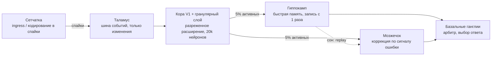

# SynapseBrain

Мозг из «микросервисов», работающий на синапсах. Часть 2 — языковая модель, которая
соревнуется с трансформером на его родной задаче; часть 1 (ниже) — первый эксперимент со зрением.

# Часть 2. SynapseBrain-LM против трансформера

**Задача:** предсказывать следующий символ текста на стандартном бенчмарке **enwik8**
(100 МБ Википедии): обучение — первые 90 МБ, тест — последние 5 МБ. Метрика — **биты на
символ (bpc)**, меньше — лучше. Всё на одной машине: 4 ядра Xeon (с AMX), без GPU.

## Итог

| | Обучение | Железо | Тест, bpc |
|---|---|---|---|
| **SynapseBrain-LM**, продолжает учиться | **6.1 мин**, один проход | **1 ядро** | **1.408** |
| **SynapseBrain-LM**, веса заморожены, рабочая память | 6.1 мин | 1 ядро | **1.485** |
| SynapseBrain-LM, строго заморожен | 6.1 мин | 1 ядро | 1.739 |
| Трансформер, **то же время** | 6.1 мин | 4 ядра + AMX bf16 | 1.906 |
| Трансформер, **в 7.3 раза дольше** | 44 мин | 4 ядра + AMX bf16 | 1.489 |

- При равном времени обучения мозг лучше трансформера во всех трёх режимах, хотя работает на
  одном ядре против четырёх с матричными ускорителями.
- Трансформеру, чтобы догнать мозг, понадобилось в 7.3 раза больше времени на вчетверо большем
  числе ядер (≈29× процессорного времени). И даже тогда он хуже (1.489 против 1.408 и 1.485).

| Минус трансформера | Трансформер | SynapseBrain-LM |
|---|---|---|
| Цена токена растёт с контекстом | 1.30 мс (1k) → 7.96 мс (64k) | **4.0 мкс при 4M и 32M** байт контекста |
| Память растёт с контекстом | KV-кэш 268 МБ при 64k (у этой крошечной модели) | фиксированная, + 1 байт на символ текста |
| Контекст ограничен окном | «иголка» за окном: 8–9 бит/символ (не помнит) | **0.1–0.3 бит/символ на расстоянии до 3 МБ** |
| Дообучение → забывание | Википедия после кода: **+55…68%** хуже | **+9.5%** |
| Нужны backprop, эпохи, GPU | да | один проход, локальные правила, 1 ядро |

## Архитектура: отделы мозга вместо внимания

Каждый байт предсказывается по битам — 8 бинарных решений. Всё учится онлайн: предсказал →
увидел правду → поменял только те синапсы, которые участвовали.

| Отдел | Что делает | Чем заменяет часть трансформера |
|---|---|---|
| **Гранулярный слой** (16 популяций) | Каждая популяция смотрит на прошлое по-своему (последние 1–8 байт, слово, пара/тройка слов, пропуски) и активирует **одну клетку** из миллионов. Клетки лежат в 64-байтных «колонках» — 2 обращения к памяти на байт на популяцию | Эмбеддинги + FFN-слои (память о том, что за чем следует) |
| **Клетки места** | Знают, «где мы» в документе: внутри `[[ссылки]]`, `{{шаблона}}`, `<тега>`, колонка строки; слово + место; «ритм» классов символов; символ над текущим в предыдущей строке | Позиционное кодирование + структура |
| **Кратковременная пластичность** | Каждая клетка помнит свои последние 6 исходов; маленькая карта превращает эту историю во второй голос | Быстрая адаптация «в контексте» |
| **Гиппокамп** (2 индекса) | Хеш последних 6 и 16 байт указывает на прошлый такой же момент; вспоминается байт, шедший дальше. O(1), расстояние не ограничено | **Индукционные головы внимания** — но без перебора всего контекста |
| **Мозжечок** (5 карт микрозон) | Смешивает голоса популяций; веса выбираются контекстом (частичный байт, новизна × состояние памяти, предыдущий байт, 2 байта) и учатся по сигналу ошибки дельта-правилом; темп обучения высокий в начале и затем снижается («критический период») | Слои смешивания + обучение (без backprop) |
| **Базальные ганглии** | Два маленьких обучаемых арбитра выбирают, кому из микрозон верить | Выходной слой |
| **Таламус** | Четыре адаптивные карты калибруют итоговую уверенность (одна — по вспомненному гиппокампом байту) | Калибровка / softmax-температура |
| **Рабочая память** | Если веса заморожены, новые контексты получают клетки в отдельной ограниченной области — долговременная память не затирается | KV-кэш |

**Три режима на тесте** (чтобы сравнение было честным):
- *строго заморожен* — не меняется ничего, кроме хранилища прочитанного текста и его индекса (аналог контекста трансформера);
- *веса заморожены, рабочая память включена* — долговременные синапсы, микрозоны и карты заморожены; меняется только кратковременная история клеток и рабочая память (аналог окна контекста / KV-кэша);
- *продолжает учиться* — естественный режим мозга: сначала предсказать, потом выучить. Для трансформера аналог — «динамическая оценка» (дообучение прямо на тесте), которая стоит ему backprop на каждом шаге.

## Как проходило сравнение (чтобы не обмануть себя)

- Трансформер — байтовый GPT (pre-LN, GELU, связанные эмбеддинги, AdamW, прогрев + косинус,
  bf16 через AMX, все 4 ядра). bf16 дал ему ускорение в 2.5 раза.
- Первая версия трансформера учила плохо из-за стандартной инициализации эмбеддинга (σ=1).
  Я заменил её на инициализацию GPT-2 (σ=0.02) — результат при 140 с улучшился с 2.83 до 2.15 bpc.
- После исправления для равного бюджета перебрано 5 конфигураций (слои, ширина, контекст, батч,
  темп обучения); взята лучшая (2 слоя, 256, контекст 128). Для длинного бюджета взята более крупная модель (4 слоя, 256, контекст 256).
- Трансформер оценивается скользящим окном: каждый предсказанный символ видит ≥ половины окна.
- Гиперпараметры мозга подбирались на первых 10–30 МБ обучающей части, тест не трогался.

## Как модель улучшалась (enwik8, тест)

| Версия | Продолжает учиться | Веса заморожены + РП | Строго заморожен | Обучение |
|---|---|---|---|---|
| v1: 8 популяций, 1 гиппокамп, 3 микрозоны | 1.600 | — | 1.779 | 139 с |
| + кратк. пластичность, микрозоны новизны и предыдущего байта | 1.485 | 1.564 | 1.839 | 266 с |
| + распределение памяти по отделам, 2-байтные микрозоны, слова-тройки | 1.444 | 1.522 | 1.815 | 287 с |
| + клетки места, ритм символов, вертикальный контекст | 1.413 | 1.491 | 1.750 | 339 с |
| + второй индекс гиппокампа, обучаемый финальный арбитр (**финал**) | **1.408** | **1.485** | **1.739** | 366 с |

Ускорения по дороге: векторизация микрозон (AVX-512, ×1.4), таблица вместо `exp`, огромные
страницы памяти (2 МБ), таблицы синапсов на диске вместо копий в RAM при оценке.

**Цена — память.** Полная модель занимает 5.9 ГБ RAM (её «синапсы»), у трансформера веса —
7–13 МБ плюс KV-кэш. С меньшей памятью:

| Память | Продолжает учиться | Веса заморожены + РП | Строго заморожен |
|---|---|---|---|
| 5.9 ГБ | 1.408 | 1.485 | 1.739 |
| 0.92 ГБ | 1.481 | 1.577 | 1.834 |
| 0.31 ГБ | 1.566 | 1.732 | 1.963 |

Даже с 0.31 ГБ модель лучше трансформера того же времени (1.906) в двух режимах из трёх.

## Честные ограничения

- **Это не «сверх-ИИ».** Биты на символ — это качество предсказания текста, а не рассуждения.
  Модель не генерирует осмысленных ответов и не понимает вопросов.
- **На масштабе трансформеры сильнее.** Большие трансформеры на GPU достигают ~0.94–0.99 bpc на
  enwik8; лучшие системы этого семейства (context mixing, например cmix) — около 1.17 bpc и очень
  медленные. Моя модель выигрывает при малых вычислениях (одна машина, минуты), и
  непонятно, как она масштабируется дальше.
- **Идея не с нуля.** Смешивание контекстов, индекс совпадений и калибровочные карты — известное
  семейство методов сжатия (PAQ, lpaq, cmix, gated linear networks). Новое здесь — устройство по
  отделам мозга (клетки места, рабочая память для замороженного режима, микрозоны новизны,
  кратковременная пластичность клеток и т.д.), инженерия скорости и прямое честное сравнение с
  трансформером на одном железе с тестами на контекст, «иголку» и забывание.
- **Модель последовательная** (бит за битом) и плохо ложится на GPU; зато ей GPU и не нужен.
- Тестовая часть enwik8 легче средней — это одинаково для обеих моделей.

## Запуск

```bash
pip install numpy numba torch scikit-learn
# положить enwik8 в data/enwik8 (https://mattmahoney.net/dc/enwik8.zip)
./run_lm_all.sh          # мозг, трансформер того же времени, контекст/«иголка», забывание (~45 мин)
python3 transformer_baseline.py --budget 2660 --layers 4 --dim 256 --ctx 256 --lr 2e-3   # 44 мин
```

Файлы: `brain_lm.py` — модель, `lm_bench.py` — enwik8, `transformer_baseline.py` +
`tx_model.py` — трансформер, `context_bench.py` — цена контекста и «иголка»,
`forget_bench.py` — забывание, `results_lm.txt` — сырые выводы всех прогонов.

---

# Часть 1. Зрение: мозг из «микросервисов» на синапсах

Эксперимент: взять повторяющиеся паттерны мозга разных животных, оформить отделы мозга как
микросервисы, которые общаются только спайками, и решить главную проблему таких моделей —
**скорость на обычном железе**. Все цифры ниже получены командой `python3 bench.py`
(полный вывод — в [`results.txt`](results.txt)), на 4 ядрах CPU, без GPU.

## 1. Что показали данные о мозге разных видов

| Вид | Факт | Что берём в архитектуру |
|---|---|---|
| Муха (FlyWire, 2024) | 139 255 нейронов, ~50 млн синапсов — полный коннектом | Грибовидное тело: ~7 случайных входов на клетку Кеньона, разреженный код |
| Мышь (MICrONS, 2025) | 1 мм³ зрительной коры: >200 тыс. клеток, 523 млн синапсов; нейроны со схожими ответами соединяются чаще | Ретинотопия: локальные рецептивные поля |
| Человек (H01, 2024) | 1 мм³ коры: ~57 тыс. клеток, ~150 млн синапсов | Масштаб: мозг ≈ 20 Вт |
| Человек (энергетика коры) | Одновременно активны лишь ~1–4% нейронов, средняя частота ~0.16 спайка/с | **Работа должна быть пропорциональна активности, а не размеру** |
| Человек, мозжечок | Гранулярных клеток больше, чем всех остальных нейронов вместе; ~4 входа на клетку | Расширяющий слой + клетка Пуркинье, обучаемая сигналом ошибки |
| Осьминог | ~500 млн нейронов, 2/3 из них в щупальцах | Децентрализация: локальные сервисы решают сами |
| Врановые и попугаи | Вдвое больше нейронов на грамм, чем у приматов | Плотность важнее размера |
| Мыши и люди | Гиппокамп быстро запоминает, кора медленно обобщает, перенос идёт во сне | Два темпа обучения + «сон» (replay) |

**Главный повторяющийся паттерн.** Один и тот же «микросервис» встречается как минимум в четырёх
структурах, причём у насекомых и позвоночных он возник независимо (конвергентная эволюция):
**расширение в большое число клеток с немногими случайными
входами + сильное торможение → разреженный код → обучаемый выход**. Он есть в грибовидном теле
мухи, гранулярном слое мозжечка, зубчатой извилине гиппокампа и грушевидной коре. Это ядро
SynapseBrain.

## 2. Отделы мозга как микросервисы



| Отдел | Роль в мозге | Аналог в микросервисах | В коде |
|---|---|---|---|
| Сетчатка | ON-клетки (свет), OFF-клетки (контур) | Входной шлюз, сериализация в события | `retina()` |
| Таламус | Реле всех чувств (кроме обоняния) в кору, открывается по сигналу базальных ганглиев | Шина событий / API-gateway: передаёт только изменения | `stream_delta()` |
| Кора V1 + гранулярный слой | Локальные рецептивные поля, расширение, торможение | Сервис признаков / хеширования | `build_cortex()`, `encode_kwta()` |
| Гиппокамп | Запоминание с одного раза, разделение паттернов, replay во сне | Append-only хранилище + фоновая репликация | `hippocampus_learn()`, `sleep_replay()` |
| Мозжечок | Клетки Пуркинье учатся по сигналу ошибки от лазящих волокон | Сервис коррекции ошибок | `cerebellum_learn()` |
| Базальные ганглии | Выбор действия растормаживанием | Арбитр / балансировщик голосов | `basal_ganglia()` |
| Гипоталамус / гомеостаз | Держит параметры в норме | Автоподстройка: каждый нейрон сам держит свою частоту ~5% | `homeostatic_theta()` |
| Не реализовано | Префронтальная кора (планирование), миндалина (приоритеты), ствол (жизнеобеспечение) | Оркестратор, алертинг, health-checks | — |

Ни один сервис не использует backprop. Кора — врождённая случайная проводка (как у мухи).
Обучаются только выходные синапсы, и только **локальными** правилами: у гиппокампа это
«активный нейрон → +1 к классу», у мозжечка «ошибка → поправить только активные синапсы».

## 3. Проблема скорости и её решение

В прошлом эксперименте модель «как у мухи» тратила в 15 раз меньше операций, чем нейросеть,
но работала в 50 раз *медленнее*. Причина: процессоры и видеокарты сделаны для плотного
умножения матриц, а разреженные модели на них обычно считают «как плотные» или через медленную
выборку. Решение повторяет то, как работает мозг: **нейрон тратит энергию только когда
приходит спайк**.

1. **Аксонные списки (scatter вместо gather).** Синапсы хранятся у *отправителя*. Пришёл
   спайк — он добавляет +1 своим ~64 целям. Работа = спайки × ветвление, а не нейроны × синапсы.
   Из 3136 входных каналов активны ~13%, и остальные вообще не трогаются.
2. **8-битные дендриты.** Сумма на дендрите ≤ K = 10, поэтому хватает `uint8`. Вся кора
   (20 000 нейронов) — это 20 КБ и живёт в L1-кэше. Горячий цикл получается без ветвлений.
3. **Торможение гистограммой.** Значения — маленькие целые, поэтому «оставить 5% самых
   активных» делается одним проходом подсчёта, без сортировки. Так работает интернейрон APL у
   мухи и клетки Гольджи в нашем мозжечке.
4. **Разреженное чтение и обучение.** Гиппокамп и мозжечок трогают только 1000 активных строк
   из 20 000.
5. **Дельта-кодирование в таламусе (для видео).** Передаются только *появившиеся* и
   *исчезнувшие* спайки. Нейрон сообщает только о пересечении порога, а ответ обновляется
   инкрементально. Результат побитово совпадает с полным пересчётом.

## 4. Результаты (тестовые выборки, среднее ± σ по 3 сидам)

Гиперпараметры выбраны на валидации (последние 10k обучающей выборки), тест не использовался
для подбора. Для сравнения взята обычная сеть 784-1000-10 с backprop (numpy/BLAS, те же 4 ядра).

**Скорость: одна и та же кора, три реализации (10k картинок, ответы идентичны 1000/1000)**

| Реализация | Время | Работа на картинку |
|---|---|---|
| Наивная выборка (как в «мухе») | 12.31 с | — |
| Плотное умножение матриц (BLAS) + top-k | 11.07 с (матмул 2.31 с) | 63 млн MAC |
| **Событийные синапсы (SynapseBrain)** | **0.23 с** | **~66 тыс. сложений** |

Итог: в 53 раза быстрее выборки, в 48 раз быстрее «плотного» варианта целиком и в 10 раз
быстрее одного только матмула на BLAS. Операций меньше примерно в 950 раз.

**Обычное обучение (60k картинок)**

| | MNIST | Время | Fashion-MNIST | Время |
|---|---|---|---|---|
| SynapseBrain: мозжечок | **96.5 ± 0.1** | 3.2 с | 80.7 ± 0.1 | 4.0 с |
| SynapseBrain: весь мозг (BG) | 95.9 ± 0.0 | 3.2 с | 81.1 ± 0.2 | 4.0 с |
| Backprop, 1 эпоха | 93.3 ± 0.1 | 1.7 с | 83.4 ± 0.1 | 1.6 с |
| Backprop, 5 эпох | 96.5 ± 0.1 | 8.4 с | 87.0 ± 0.1 | 8.5 с |
| Backprop, 10 эпох | 97.4 ± 0.0 | 17.1 с | 88.0 ± 0.0 | 17.2 с |

На MNIST SynapseBrain достигает той же точности, что backprop, в **2.1–2.6 раза быстрее**.
На Fashion-MNIST он **проигрывает**: 81% против 87%. Врождённые случайные признаки плохо
передают текстуру ткани.

**Задачи по очереди (0/1 → 2/3 → … → 8/9, каждая видна один раз)**

| | MNIST | Fashion-MNIST |
|---|---|---|
| Backprop | 23.3 ± 0.1 (забыл всё, кроме последней задачи) | 27.5 ± 0.3 |
| Мозжечок без сна | 20.7 ± 0.3 | 20.1 ± 0.3 |
| Гиппокамп | 82.8 ± 0.2 | 66.0 ± 0.1 |
| Мозжечок + сон (replay из гиппокампа) | 83.3 ± 0.4 | 64.6 ± 0.5 |
| **Весь мозг (BG)** | **86.3 ± 0.3** | **66.9 ± 0.3** |

«Сон» поднимает мозжечок с 21% до 83%: гиппокамп «снит» разреженные коды прошлых классов,
не храня ни одной картинки.

**Видеопоток, 9000 кадров, дельта-кодирование в таламусе**

| Сценарий | Операций на кадр: полный пересчёт → дельта | Время | Совпадение ответов |
|---|---|---|---|
| Неподвижная камера, 1% шума | 65.8k → 17.7k (**в 3.7 раза меньше**) | в 7.0 раза быстрее | 100%, разница 0 |
| Движущийся объект | 59.8k → 48.2k (в 1.2 раза меньше) | в 2.2 раза быстрее | 100%, разница 0 |

Ускорение по времени больше, чем по операциям: полный пересчёт вынужден проверять каждый
затронутый нейрон, а дельта — только те, у которых изменился вход.

## 5. Что доказано, а что нет

**Доказано (в рамках этих тестов):**
- событийное исполнение синапсов на обычном CPU даёт **точно тот же** результат, что плотное,
  и делает это в 10–50 раз быстрее. Причина — в ~950 раз меньше работы;
- система без backprop, обученная одним проходом по «коре» и локальными правилами, достигает
  точности backprop на MNIST в 2+ раза быстрее;
- гиппокамп + «сон» почти устраняют катастрофическое забывание (86% против 23%);
- на неподвижной сцене дельта-кодирование сокращает работу почти вчетверо без потери точности.

**Не доказано / ограничения:**
- Это распознавание картинок 28×28, а не язык и не рассуждение. До «сверх-ИИ» — пропасть.
- На текстурах (Fashion-MNIST) модель заметно хуже backprop. Врождённые признаки надо либо
  «эволюционировать», либо дообучать локальными правилами — это следующий шаг.
- На GPU плотный матмул для такой маленькой модели почти мгновенен. Преимущество событийного
  подхода — на CPU, нейроморфных чипах (Intel Hala Point) и при высокой разреженности.
- При движении объекта дельта-кодирование почти не экономит операции: меняется большинство входов.
- Отдельные идеи известны: fly hashing, модель мозжечка Марра–Альбуса, complementary learning
  systems, дельта-сети, событийные симуляторы SNN. Новое здесь — их сборка в систему
  микросервисов, быстрая реализация и замеры.

## Запуск

```bash
pip install numpy numba scikit-learn
python3 bench.py      # скачает MNIST и Fashion-MNIST при первом запуске, ~5 минут на 4 ядрах
```

## Источники

- FlyWire: [Neuronal wiring diagram of an adult brain (Nature, 2024)](https://www.nature.com/articles/s41586-024-07558-y)
- MICrONS: [Functional connectomics spanning multiple areas of mouse visual cortex (Nature, 2025)](https://www.nature.com/articles/s41586-025-08790-w), [MICrONS Explorer](https://www.microns-explorer.org/cortical-mm3)
- H01: [A petavoxel fragment of human cerebral cortex (Science, 2024)](https://www.science.org/doi/10.1126/science.adk4858)
- Энергетика коры: [Lennie, The Cost of Cortical Computation (Current Biology, 2003)](https://www.cell.com/current-biology/fulltext/S0960-9822(03)00135-0)
- Расширение и разреженность в разных видах: [Sparse synaptic connectivity is required for decorrelation and pattern separation (Nat. Commun., 2017)](https://www.nature.com/articles/s41467-017-01109-y), [Representation learning in cerebellum-like structures](https://arxiv.org/pdf/2511.10261), [Task-dependent optimal representations for cerebellar learning (eLife)](https://elifesciences.org/articles/82914)
- Осьминог: [The autonomous arms of the octopus (Lab Animal)](https://www.nature.com/articles/laban.615)
- Птицы: [Olkowicz et al., Birds have primate-like numbers of neurons in the forebrain (PNAS, 2016)](https://www.pnas.org/doi/10.1073/pnas.1517131113)
- Базальные ганглии и таламус: [Selection of actions in the basal ganglia-thalamocortical circuits](https://pubmed.ncbi.nlm.nih.gov/10076774/), [Basal ganglia output to the thalamus: still a paradox](https://pmc.ncbi.nlm.nih.gov/articles/PMC3855885/)
- Complementary learning systems: [McClelland, McNaughton, O'Reilly (1995)](https://www.researchgate.net/publication/15575602_Why_There_are_Complementary_Learning_Systems_in_the_Hippocampus_and_Neocortex_Insights_from_the_Successes_and_Failures_of_Connectionist_Models_of_Learning_and_Memory)
- Нейроморфное железо: [Intel Hala Point](https://newsroom.intel.com/artificial-intelligence/intel-builds-worlds-largest-neuromorphic-system-to-enable-more-sustainable-ai)
